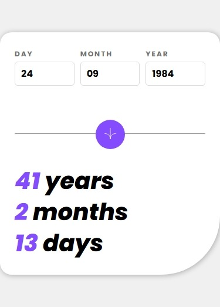
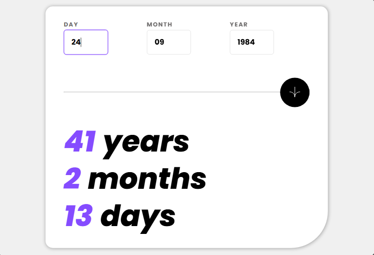
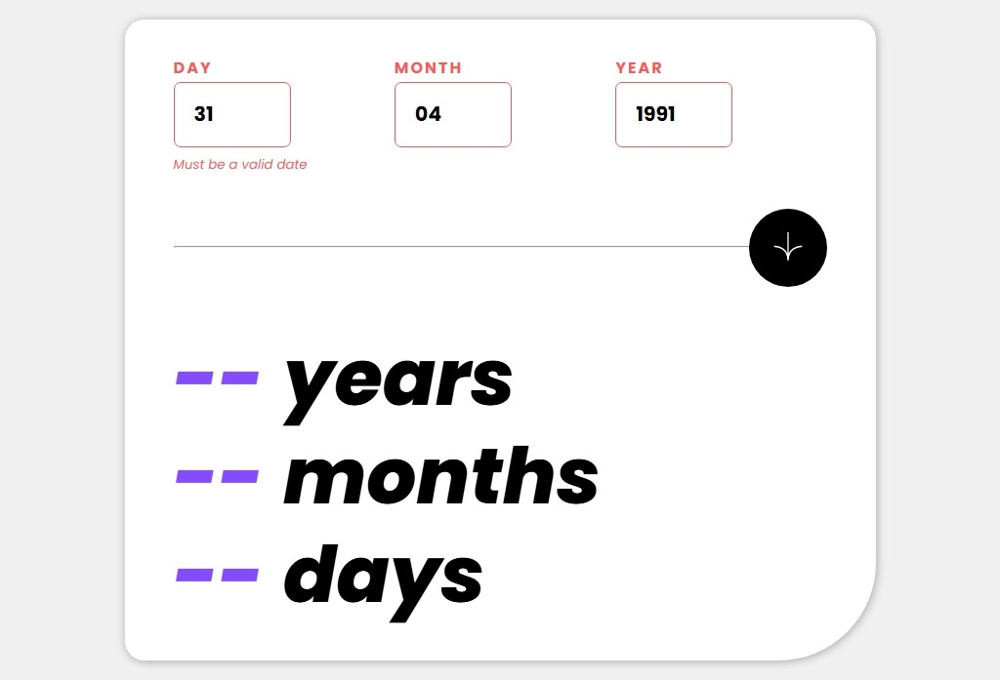
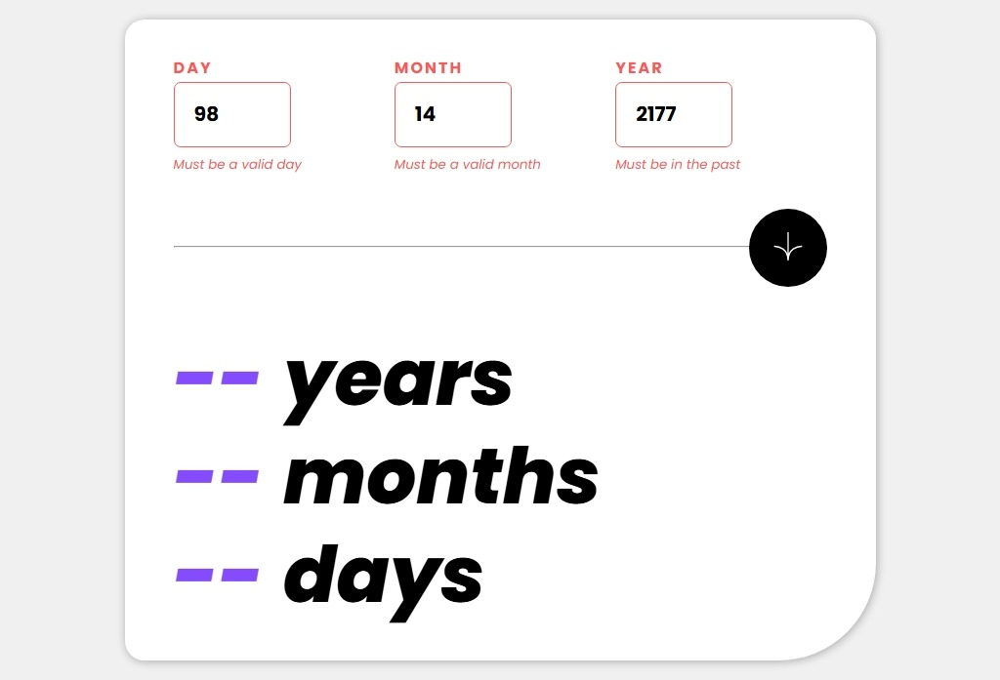
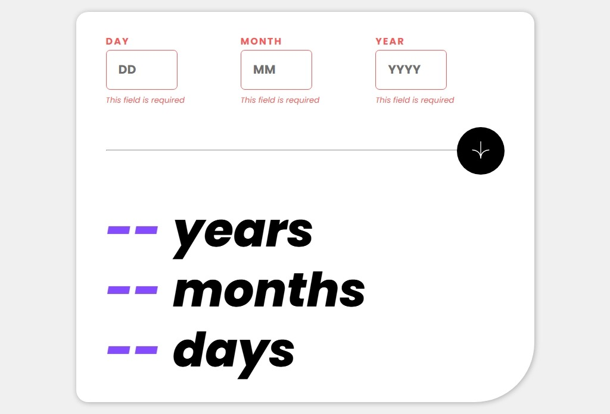

# age-calculator-app

This is a solution to the [age-calculator-app on Frontend Mentor](https://gillaercio.github.io/age-calculator-app-main/). Frontend Mentor challenges help you improve your coding skills by building realistic projects. 

## Table of contents

- [Overview](#overview)
  - [Screenshot](#screenshot)
  - [Links](#links)
- [My process](#my-process)
  - [Built with](#built-with)
  - [What I learned](#what-i-learned)
  - [Continued development](#continued-development)
- [Author](#author)

## Overview

### Screenshot

These are my screenshots showing how the project turned out.

- Mobile design:



- Desktop design:


- Active state:



- Error whole form:



- Error invalid form:



- Error empty form:



### Links

- Solution URL: [My Solution](https://github.com/gillaercio/expenses-chart-component-main)

## My process

### Built with

- Semantic HTML5 markup
- CSS custom properties
- Flexbox
- CSS Grid
- Mobile-first workflow
- JavaScript

### What I learned

I took advantage of this project to practice using **BEM** with HTML, **Pseudo-elements** and **Reset CSS** with **CSS** and **Events and validations** with **JavaScript**:

BEM (Block Element Modifier)

```html
  <div class="calculate-divider">
    <hr class="calculate-divider__line">
    <button type="submit" class="calculate-divider__button" id="calculate-button">
      
    </button>
  </div>
```

Pseudo-element

```css
*,
*::before,
*::after {
  margin: 0;
  padding: 0;
  box-sizing: border-box;
}
```

Events and validations

```js
function calculateAge(event) {
  event.preventDefault()

  const dayField = document.querySelector('.date-input--day .date-input__field');
  const monthField = document.querySelector('.date-input--month .date-input__field');
  const yearField = document.querySelector('.date-input--year .date-input__field');
  
  const inputs = [dayField, monthField, yearField];
  const labels = document.querySelectorAll('.date-input__label');
  const errorMessages = document.querySelectorAll('.error-message');
  
  let hasError = false;
  
  inputs.forEach((input, index) => {
      input.classList.remove("input-error");
      labels[index].classList.remove("label-error");
      errorMessages[index].textContent = "";
      errorMessages[index].classList.remove("visible");
  });

  inputs.forEach((input, index) => {
    if(input.value.trim() === "") {
      errorMessages[index].textContent = "This field is required";
      errorMessages[index].classList.add("visible");
      input.classList.add("input-error");
      labels[index].classList.add("label-error");
      hasError = true;
    }
  });

  if (hasError) return;

  // ...
```

### Continued development

I would like to improve the use of the **HTML**, **CSS** and **JavaScript**.

## Author

- Frontend Mentor - [@gillaercio](https://www.frontendmentor.io/profile/gillaercio)
- Github - [My Github](https://github.com/gillaercio)
- LinkedIn - [My LinkedIn](https://www.linkedin.com/in/gildman-la%C3%A9rcio/)